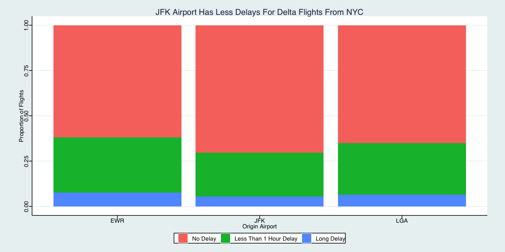
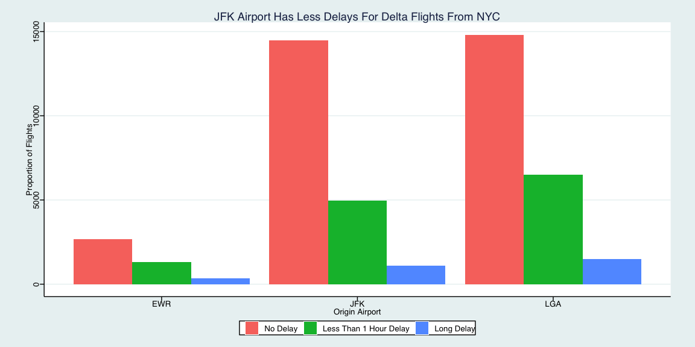
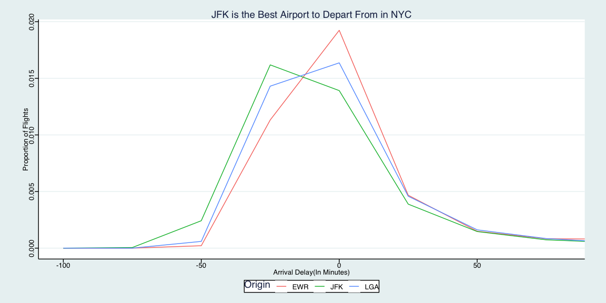
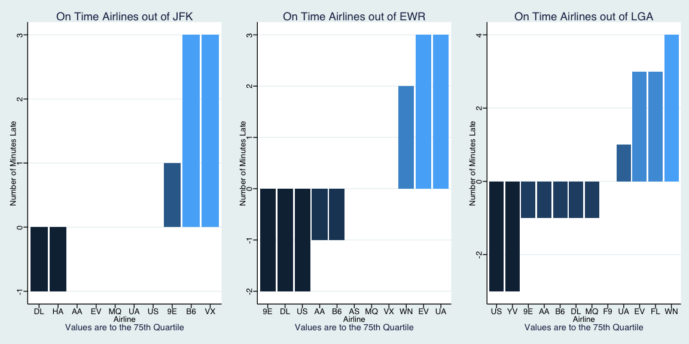

```r
# Use this R-Chunk to import all your datasets!
```

## Background

I created graphics to solve the following 2 questions:

1. Which origin airport is best to minimize my chances of a late arrival when I am using Delta Airlines?

2. If I am leaving before noon, which two airlines do you recommend at each airport (JFK, LGA, EWR) that will have the lowest delay time at the 75th percentile?


## Question #1

When trying to decide which Delta Origin Airport would be the best, I found that a bar chart looked best. According to our bar chart, JFK has the best possibility of arriving at the airport on time. If you're pressed for time, you should definitely use JFK.


```r
# Use this R-Chunk to clean & wrangle your data!
delta<-flights%>%
  filter(carrier == 'DL' & !is.na(arr_delay & !is.na(origin)))

delta$arrdelay<-cut(delta$arr_delay, c(-500, 1, 60, 1000), c('No Delay', 'Less Than 1 Hour Delay','Long Delay'))
```

```r
# Use this R-Chunk to plot & visualize your data!
delta%>%
  ggplot(mapping = aes(x = origin, fill = arrdelay))+
  geom_bar(position = 'fill')+
  theme_stata()+
  labs(title = 'JFK Airport Has Less Delays For Delta Flights From NYC', x = 'Origin Airport', y = 'Proportion of Flights', fill = '')
```

<!-- -->


```r
# Use this R-Chunk to plot & visualize your data!
delta%>%
  ggplot(mapping = aes(x = origin, fill = arrdelay))+
  geom_bar(position = 'dodge')+
  theme_stata()+
  labs(title = 'JFK Airport Has Less Delays For Delta Flights From NYC', x = 'Origin Airport', y = 'Proportion of Flights', fill = '')
```

<!-- -->


```r
delta%>%
  ggplot(mapping = aes(x = arr_delay, y = ..density..))+
  geom_freqpoly(aes(color = origin), binwidth = 25)+
  coord_cartesian(xlim = c(-100, 80))+
  theme_stata()+
  labs(title = 'JFK is the Best Airport to Depart From in NYC', x = 'Arrival Delay(In Minutes)', y = 'Proportion of Flights', color = 'Origin')
```

<!-- -->

## Question #2

While answering this question, I struggled significantly to figure out ho to put them all on the same plot. If you have any ideas, please let me know. However, I created 3 different bar plots to help describe which airline to take before noon with the best on time departures. For JFK, The two best airlines to travel would be DL and HA. For EWR, the best airlines to travel would be DL, US, and 9E. Then, for LGA, the best airlines are US and YV. 

```r
plot1<-flights%>%
  group_by(carrier)%>%
  filter(!is.na(dep_delay) & !is.na(carrier) & dep_time < 1200 & origin == 'JFK')%>%
  summarise(quantile = quantile(dep_delay, probs = .75))%>%
  transform(carrier = reorder(carrier, quantile))%>%
    ggplot(mapping = aes(x = carrier, y = quantile, fill = quantile))+
  geom_bar(mapping = aes(x = carrier, y = quantile, fill = quantile), stat = 'identity')+
  labs(title = "On Time Airlines out of JFK", caption = 'Values are to the 75th Quartile', x = 'Airline', y = 'Number of Minutes Late', fill = 'Minutes Late')+
  theme_stata()+
  guides(fill = FALSE)
```

```r
plot2<-flights%>%
  group_by(carrier)%>%
  filter(!is.na(dep_delay) & !is.na(carrier) & dep_time < 1200 & origin == 'EWR')%>%
  summarise(quantile = quantile(dep_delay, probs = .75))%>%
  transform(carrier = reorder(carrier, quantile))%>%
    ggplot(mapping = aes(x = carrier, y = quantile, fill = quantile))+
  geom_bar(mapping = aes(x = carrier, y = quantile, fill = quantile), stat = 'identity')+
  labs(title = "On Time Airlines out of EWR", caption = 'Values are to the 75th Quartile', x = 'Airline', y = 'Number of Minutes Late', fill = 'Minutes Late')+
  theme_stata()+
  guides(fill = FALSE)
```

```r
plot3<-flights%>%
  group_by(carrier)%>%
  filter(!is.na(dep_delay) & !is.na(carrier) & dep_time < 1200 & origin == 'LGA')%>%
  summarise(quantile = quantile(dep_delay, probs = .75))%>%
  transform(carrier = reorder(carrier, quantile))%>%
    ggplot(mapping = aes(x = carrier, y = quantile, fill = quantile))+
  geom_bar(mapping = aes(x = carrier, y = quantile, fill = quantile), stat = 'identity')+
  labs(title = "On Time Airlines out of LGA", caption = 'Values are to the 75th Quartile', x = 'Airline', y = 'Number of Minutes Late', fill = 'Minutes Late')+
  theme_stata()+
  guides(fill = FALSE)

require(gridExtra)
grid.arrange(plot1, plot2, plot3, ncol=3)
```

<!-- -->

## Quote

'If the data don’t have a question yet, I usually start thinking right away about what questions can actually be answered with the data and what can’t. This prevents me from wasting a lot of time later chasing trends.'
