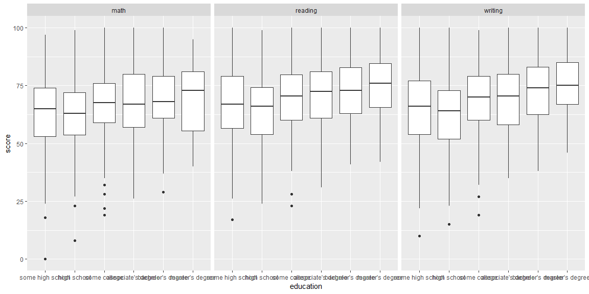
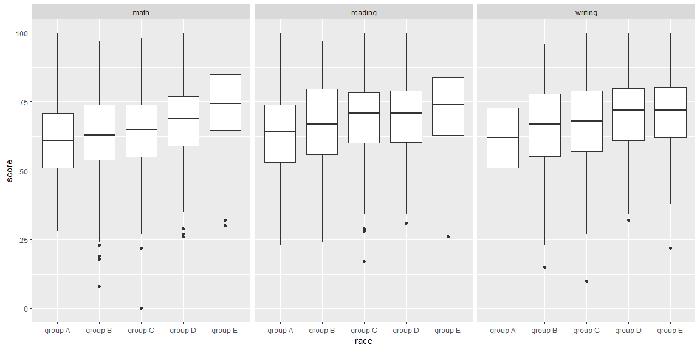
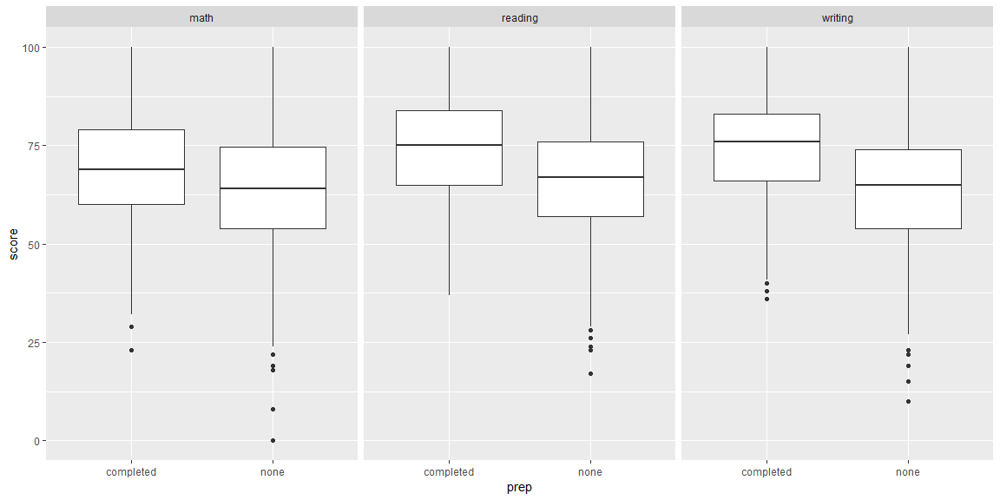

```r
tests <- read_csv('C:/Users/loganvj/Documents/StudentsPerformance.csv')
tests <- tests %>%
  mutate(race = tests$`race/ethnicity`, pareduc = tests$`parental level of education`, prep = tests$`test preparation course`, math = tests$`math score`, reading = tests$`reading score`, writing = tests$`writing score`) %>%
  select(gender, race, pareduc, lunch, prep, math, reading, writing)
test1 <- tests %>%
  gather(math, reading, writing, key = type, value = score) 
```


```r
test1 %>%
  mutate(education = fct_relevel(pareduc, c('some high school', 'high school', 'some college',"associate's degree", "bachelor's degree", "master's degree"))) %>%
  ggplot()+
  geom_boxplot(aes(x = education, y = score)) +
  facet_wrap(~type)
```

<!-- -->


```r
test1 <- tests %>%
  gather(math, reading, writing, key = type, value = score) 
test1 %>%
  ggplot() +
  geom_boxplot(aes(x = race, y = score)) +
  facet_wrap(~type)
```

<!-- -->


```r
test1 %>%
  ggplot() +
  geom_boxplot(aes(x = prep, y = score)) +
  facet_wrap(~type)
```

<!-- -->

